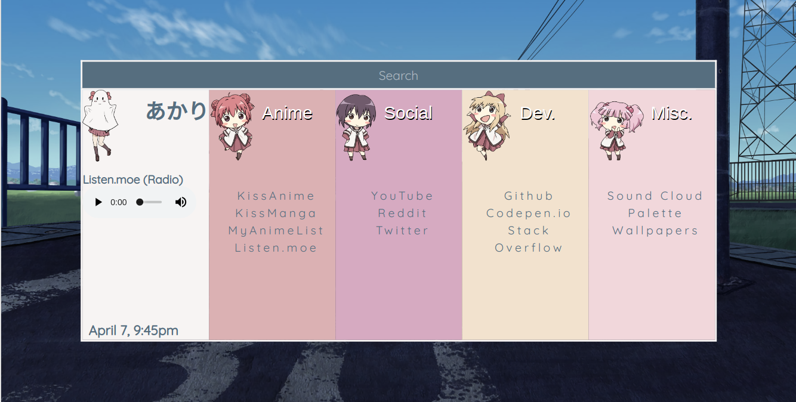

# YuruYuri-Start


[Demo](https://qnnie.github.io/YuruYuri-Start/)

How To Use as startpage
------------------------------
<ol>
          <li>Create github account</li>
          <li>Fork repository</li>
          <li>Go to the settings of your forked repo</li>
          <li>Enable github pages</li>
          <li>Go to your browser settings and enter custom 'on startup' link</li>
</ol>    
Configure Links (once downloaded)
----------------------------
Open up index.html and look for 
```html
          <h3>Anime</h3>
                <ul>
                    <li><a href='https://kissanime.ru'>KissAnime</a></li>
                    <li><a href='http://kissmanga.com'>KissManga</a></li>
                    <li><a href='https://myanimelist.net'>MyAnimeList</a></li>
                    <li><a href='https://listen.moe'>Listen.moe</a></li>
                </ul>
```
Make the necessary changes and reopen the HTML file in a browser.
<br>
Feel free to look around and mess around with whats there, im a beginner so it's all pretty basic. Enjoy~

